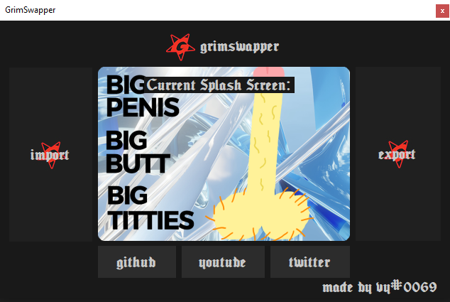

<h1 align="center">
   
  AE Splash Changer GUI Beta
   
</h1>

<h4 align="center">Easily Customize the After Effects Splash Screen!</a>!</h4>

  

## Installation

1. Download the latest version from **releases**. -->
2. Extract the zip and run the GrimSwapper.exe
3. Import Your Custom Splash Screen
4. Then Export
5. Done!

## Support

Should Support Most AE Versions 2016++

Tested On:
* After Effects 2022

If it does not work on your version, please contact me.

## Todo

* Embed ResourceHacker.exe into the main executable to make stand-alone.
* Add more ae version support
* Actually center the UI lol
* change way the program detects the after effects directory, was in a rush so it's a bunch of slow if statements
* right click picture box to save as
* replace ae_splash 2x and 3x too just in case

## Credit

- [ResourceHacker](http://angusj.com/resourcehacker/)

---

**Please contact me if you find any bugs or have any suggestions.**
#### Twitter: @kruumy
#### Discord: kruumy#9443

